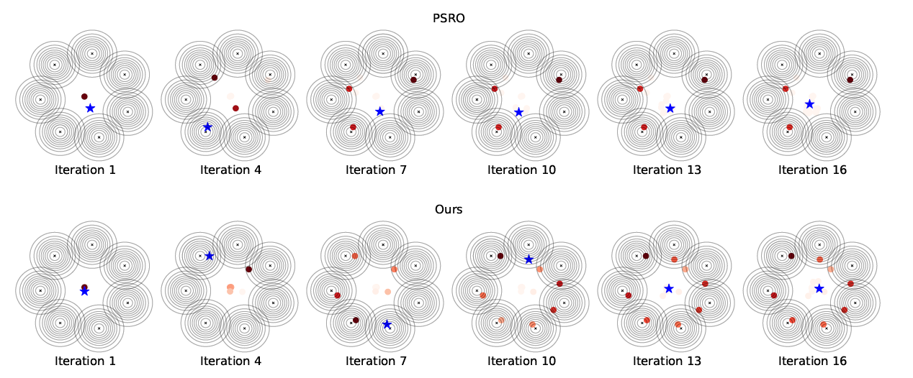

# NAC

Official PyTorch implementation of NAC from the paper: 

[Neural Auto-Curricula in Two-Player Zero-Sum Games](https://arxiv.org/abs/2106.02745).

We release code for: Gradient based oracle(Game of skills/2d-rps), Implicit gradient(2d-rps), RL(IMP) and ES based training for Kuhn-poker.

## How to run
We set our hyperparameters in the python file so you just need to run model_train.py in the corresponding directory. We also offer our pretrain model for direct test.

We use wandb to log experimental results, you may need to register for an account before running the code.

## How to test
Run test.py and you can check the comment in test.py for different test configurations.

```python
conda env create -f lmac.yml
conda activate lmac
```

### 2D-RPS visualization

Visualisation results can be tested in:

2d-rps-gradient/visualisation/visualization_2d_rps.ipynb.

### Kuhn->Leduc Generalization


we provide a local implementation in which one can reproduce the results of generalising our models trained on Kuhn Poker to Leduc Poker.

```python
cd leduc_poker
# To reproduce the approximate best-response results
python3 kuhn_to_leduc.py --br_type 'approx_br_rand'
# To reproduce the exact best-response results
python3 kuhn_to_leduc.py --br_type 'exact_br'
```
## Cite
Please cite our paper if you use the code or datasets in your own work:
```
@article{feng2021NAC,
  title={Neural Auto-Curricula},
  author={Feng, Xidong and Slumbers, Oliver and Yang, Yaodong and Wan, Ziyu and Liu, Bo and McAleer, Stephen and Wen, Ying and Wang, Jun},
  journal={arXiv preprint arXiv:2106.02745},
  year={2021}
}
```


